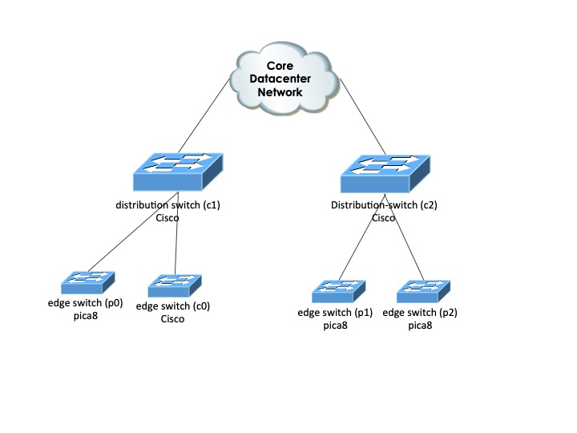

Datacenter Q-in-Q Tunneling Example
===================================

This example illustrates creating a Q-in-Q tunnel in a data center using NSO.
In data centers, it is often desirable to separate traffic at
layer2 between different customers or to virtualize a complete data center.
One way to achieve this is to set up Q-in-Q (dot1q) tunneling to create
layer2 VPNs.

In this example, we will create two customer networks spanning different edge
and core switches. The network consists of Cisco IOS and Pica8 devices.

We have created a service model that defines a customer Q-in-Q VPN.

Running the Example
-------------------

To run the steps below in this README from a demo shell script:

    make demo

The below steps are similar to the demo script using the J-style CLI instead of
the C-style CLI.

Start clean, i.e., no old configuration data is present:

    make stop clean

Setup the simulated network and build the packages:

    make all

Start the simulated network and NSO:

    make start

Syncing from the Network
------------------------

NSO is configured with which devices exist in the network as the `Makefile` ran
the `ncs-netsim` tool to generate the `ncs-cdb/netsim_devices_init.xml`
initialization file that NSO loaded in CDB at startup. But NSO has not yet
connected to any of them.

The XML init file containing the device configuration:

    cat ./ncs-cdb/ncs_init.xml

The XML file contains information on which address and port the devices are
configured on and which authgroup should be used when authenticating the
device. Since the configuration is in CDB, you can show it from, for example,
the NSO CLI:

    ncs_cli -u admin
    > show configuration devices device

It's important to note that no actual "device config" is present at this time,
only meta data about the device.

Before provisioning any services, we need to pull the configuration from the
devices in the network. Start by syncing configuration from the devices:

    > request devices sync-from

NSO retrieves all config defined by the YANG models representing what can be
configured on the device and is now ready to manage the network. Inspect the
configuration by showing what's in the NSO configuration database (CDB) now:

    > show configuration devices device config

This lists the configuration for all devices.

Configuring the Service
-----------------------

First, configure `customer1` according to the network picture above. Configure
the S-VLAN that this customer network will use.

*Note*: No guards are preventing using the same S-VLAN between the Java-based
and the template-based services. If you experiment with this, you should keep
track of it yourself.

    > configure
    % set services service customer1 type qinq s-vlan 444

Set up the edge devices and interfaces to be used:

    % set services service customer1 type qinq edge-switch p0 trunk-interface \
      ae10
    % set services service customer1 type qinq edge-switch p0 edge-interface \
      ge-1/1/1 c-vlan [ 13 15 ]
    % set services service customer1 type qinq edge-switch p1 trunk-interface \
      ae10
    % set services service customer1 type qinq edge-switch p1 edge-interface \
      ge-1/1/1 c-vlan [ 15 ]
    % set services service customer1 type qinq edge-switch p2 trunk-interface \
      ae10
    % set services service customer1 type qinq edge-switch p2 edge-interface \
      ge-1/1/1 c-vlan [ 13 ]

Configure the core switches:

    % set services service customer1 type qinq core-switch c1 trunk-interface \
      [ "FastEthernet 1/1" "FastEthernet 1/2" ]
    % set services service customer1 type qinq core-switch c2 trunk-interface \
      [ "FastEthernet 1/1" "FastEthernet 1/2" ]

Commit the changes:

    % commit dry-run
    % commit

Configure `customer2`:

    % set services service customer2 type qinq s-vlan 777

Edge devices and interfaces:

    % set services service customer2 type qinq edge-switch p2 trunk-interface \
      ae10
    % set services service customer2 type qinq edge-switch p2 edge-interface \
      ge-1/1/2 c-vlan [ 13 ]
    % set services service customer2 type qinq edge-switch p2 edge-interface \
      ge-1/1/3 c-vlan [ 15 ]
    % set services service customer2 type qinq edge-switch c0 trunk-interface \
      "FastEthernet 1/2"
    % set services service customer2 type qinq edge-switch c0 edge-interface \
      "FastEthernet 1/0" c-vlan [ 13 15 ]

Configure the core switches:

    % set services service customer2 type qinq core-switch c1 trunk-interface \
      [ "FastEthernet 1/1" "FastEthernet 1/2" ]
    % set services service customer2 type qinq core-switch c2 trunk-interface \
      [ "FastEthernet 1/1" "FastEthernet 1/2" ]

A handy tool is the CLI `commit dry-run` command. It lets you review what
device configuration will be sent to the devices if we commit the service
configuration we just added. In this case, we will also use the extra
parameters `outformat native` to view the configuration changes in its actual
device native format, i.e., what is sent to the device.

    % commit dry-run outformat native

Let's look at the output for `c0` and `c1`, a Cisco edge and core switches:

    native {
        device {
            name c0
            data vlan 777
                    !
                    interface FastEthernet1/0
                    switchport access vlan 777
                    switchport mode dot1q-tunnel
                    spanning-tree bpduguard enable
                    spanning-tree portfast
                    exit
                    interface FastEthernet1/2
                    switchport mode trunk
                    switchport trunk allowed vlan 777
                    exit
        }
        device {
            name c1
            data vlan 777
                    !
                    interface FastEthernet1/1
                    switchport trunk allowed vlan 444,777
                    exit
                    interface FastEthernet1/2
                    switchport trunk allowed vlan 444,777
                    exit
        }
    }

Note that this is the configuration change and not the complete device
configuration. We can see that the edge and core interfaces are set up with the
appropriate S-VLAN. One thing to note here is the configuration for `c1`, where
both S-VLAN `444` and `777` are allowed on the trunks since both customer
networks use them.

Commit the changes:

    % commit

NSO Power Tools
---------------

NSO has several of valuable features and tools for provisioning configuration
changes and maintaining service configuration integrity.

As shown above, the `commit dry-run` CLI command is one of them. is one of
them. For example, large customer network configuration changes to the S-VLAN
are challenging. NSO greatly simplifies this task.

Change the S-VLAN for `customer2` to `200`:

    % set services service customer2 type qinq s-vlan 200

Use commit dry-run to review the resulting device configuration changes:

    % commit dry-run outformat native

You can see from the output how the NSO service will automatically reconfigure
all affected devices.

    % commit
    % exit
    > exit

Out-of-band Configuration
-------------------------

NSO can be used to check if the configuration in the network is up to date.

In a new terminal window, connect directly to the device `c0`, a simulated
Cisco IOS netsim device.

    ncs-netsim cli-c c0

Reconfigure an edge interface that was previously configured using NSO:

    config
    vlan 1234
    exit
    interface FastEthernet 1/0
    switchport access vlan 1234
    commit

Using the NSO CLI, check the status of the network configuration:

    ncs_cli -u admin
    > request devices check-sync

Results in the following output show that the `c0` configuration is
out of sync with NSO:

    sync-result {
        device c0
        result out-of-sync
    }
    sync-result {
        device c1
        result in-sync
    }

Before we repair the network configuration, let's try adding a new service
instance that uses the out-of-sync device and see how NSO responds:

    % configure
    % set services service customer3 type qinq s-vlan 999
    % set services service customer3 type qinq edge-switch c0 trunk-interface \
      "FastEthernet 1/2"
    % set services service customer3 type qinq edge-switch c0 edge-interface \
      "FastEthernet 1/1" c-vlan [ 13 15 ]
    % commit dry-run
    % commit
    Aborted: Network Element Driver: device c0: out of sync

We cannot create another service if the network is out of sync. Revert
the proposed changes:

    % revert

Sync from the device and see how it affects our *services*:

    % request devices device c0 sync-from
    % request devices check-sync
    sync-result {
        device c0
        result in-sync
    }
    sync-result {
        device c1
        result in-sync
    }

    % request services check-sync
    sync-result {
        service-id customer1
        in-sync true
    }
    sync-result {
        service-id customer2
        in-sync false
    }

The service `customer2` is out of sync with the device configuration. Debug the
issue:

    % request services service customer2 check-sync outformat cli
    cli  devices {
             device c0 {
                 config {
                     ios:interface {
                         FastEthernet 1/0 {
                             switchport {
                                 access {
        -                            vlan 1234;
        +                            vlan 200;
                                 }
                             }
                         }
                     }
                 }
             }
         }

"Someone" has been messing with the vlan configuration. To repair the service,
we can have NSO re-deploy the service:

    % request services service customer2 type qinq re-deploy

Check sync status:

    % request devices check-sync
    % request services check-sync

Another useful tool is to list what services are configured on what devices:

    % show devices device service-list

        NAME  SERVICE LIST
        -------------------------------
        c0    [ customer2 ]
        c1    [ customer2 customer1 ]
        c2    [ customer2 customer1 ]
        p0    [ customer1 ]
        p1    [ customer1 ]
        p2    [ customer2 customer1 ]
        p3    [  ]

Must Validation
---------------

In the YANG modeling language, see IETF RFC 7950 - The YANG 1.1 Data Modeling
Language, you can put logical constraints in the actual data model using
XPath statements. In the service model, we have two must statements:

        must "count(/ncs:services/ncs:service/ncs:type/q:qinq" +
             "[s-vlan = current()/q:s-vlan]) = 1"
        {
          error-message "The S-VLAN must be unique within the " +
                        "network";
        }

The first statement ensures that an S-VLAN must be unique among all service
instances.

    must "(count(/ncs:services/ncs:service/ncs:type/q:qinq" +
         "/q:edge-switch[q:switch = current()/../../switch]" +
         "/q:edge-interface[q:interface = current()]) = 1) " +
         "and " +
         "(not (../../../core-switch/trunk-interface[. = current()]))"
    {
      error-message "Edge interface must be unique";
    }

The second ensures that one service instance can only use an edge interface.
Let's test how this works in NSO when configuring a service:

    % set services service customer3 type qinq s-vlan 444
    % commit dry-run
    % commit

    Aborted: 'services service customer3 type qinq' : The S-VLAN must be \
    unique within the network

An error was triggered from the first `must` statement XPath expression.

    % revert

Test triggering the second `must` statement with a nonunique edge interface:

    % set services service customer3 type qinq s-vlan 555
    % set services service customer3 type qinq edge-switch c0 trunk-interface \
      "FastEthernet 1/2"
    % set services service customer3 type qinq edge-switch c0 edge-interface \
      "FastEthernet 1/0" c-vlan [ 13 15 ]
    % set services service customer3 type qinq core-switch c1 \
      trunk-interface [ "FastEthernet 1/1" "FastEthernet 1/2" ]
    % set services service customer3 type qinq core-switch c2 \
      trunk-interface [ "FastEthernet 1/1" "FastEthernet 1/2" ]
    % commit dry-run
    % commit

    Aborted: 'services service customer3 type qinq edge-switch c0 \
    edge-interface "FastEthernet 1/0" interface' (value "FastEthernet 1/0"): \
    Edge interface must be unique

    % revert

Alarms
------

NSO can manage alarms. NSO models alarms as states where an alarm is raised,
can change severity, be cleared, and come active again. Users can also set the
states as acknowledged.

NSO "groups" together underlying events (from traps, syslog, application
code, etc) into states of the same alarm. The info for an alarm is as follows:

* Device
* Object within the device: such as a specific interface
* Alarm type: a defined YANG identity that uniquely defines the type of alarm
* Specific problem: if the type of alarm can only be defined at run-time,
  for example, the value of an SNMP notification var-bind, the specific
  problem, which is a string, can be used to separate alarm types.

Let's generate an alarm:

    cd $NCS_DIR/examples.ncs/datacenter-qinq/alarms
    make alarm-1

From the NSO CLI:

    ncs_cli -u admin
    > show alarms alarm-list
    alarms alarm-list number-of-alarms 2
    alarms alarm-list last-changed 2024-10-28T11:12:14.563+00:00
    alarms alarm-list alarm c0 out-of-sync /devices/device[name='c0'] ""
     is-cleared              true
     last-status-change      2024-10-28T11:12:13.035679+00:00
     last-perceived-severity major
     last-alarm-text         "Device c0 is out of sync"
     status-change 2024-10-28T11:12:12.682904+00:00
      received-time      2024-10-28T11:12:12.682904+00:00
      perceived-severity major
      alarm-text         "got: 35a32ef42e680152f2c534f3b16397de expected: \
      92ef1cc6403748e3273c42c6d23c91b2\n"
     status-change 2024-10-28T11:12:12.875253+00:00
      received-time      2024-10-28T11:12:12.875253+00:00
      perceived-severity major
      alarm-text         "Device c0 is out of sync"
     status-change 2024-10-28T11:12:13.035679+00:00
      received-time      2024-10-28T11:12:13.035679+00:00
      perceived-severity cleared
    alarms alarm-list alarm c0 spanning-tree-alarm /devices/device[name='c0']\
    /config/ios:interface/FastEthernet[name='1/0']/switchport spanning-tree
     is-cleared              false
     last-status-change      2024-10-28T11:12:14.563+00:00
     last-perceived-severity critical
     last-alarm-text         "Spanning Tree BPDU received on edge interface. \
     Interface set to errdisable state."
     status-change 2024-10-28T11:12:14.563+00:00
      received-time      2024-10-28T11:12:14.565+00:00
      perceived-severity critical
      alarm-text         "Spanning Tree BPDU received on edge interface. \
      Interface set to errdisable state."

Here, we see that we have one alarm with the following keys:
* Device: `c0`
* Object: `/devices/device[name=\"c0\"]/config/ios:interface/\`
          `FastEthernet[name=\"1/0\"]`
* Alarm type: spanning-tree-alarm (see
  `packages/qinq-alarm/src/yang.qinq-alarm.yang`)
* Specific problem: "spanning-tree", this is not really needed here but set
  anyhow

Toggle the alarm:

    cd $NCS_DIR/examples.ncs/datacenter-qinq/alarms
    make alarm-1
    make clear-1
    > show alarms alarm-list
    alarms alarm-list number-of-alarms 2
    alarms alarm-list last-changed 2024-10-28T11:09:34.337+00:00
    alarms alarm-list alarm c0 out-of-sync /devices/device[name='c0'] ""
     is-cleared              true
     last-status-change      2024-10-28T11:09:27.162025+00:00
     last-perceived-severity major
     last-alarm-text         "Device c0 is out of sync"
     status-change 2024-10-28T11:09:26.789321+00:00
      received-time      2024-10-28T11:09:26.789321+00:00
      perceived-severity major
      alarm-text         "got: 35a32ef42e680152f2c534f3b16397de expected: \
      92ef1cc6403748e3273c42c6d23c91b2\n"
     status-change 2024-10-28T11:09:26.990813+00:00
      received-time      2024-10-28T11:09:26.990813+00:00
      perceived-severity major
      alarm-text         "Device c0 is out of sync"
     status-change 2024-10-28T11:09:27.162025+00:00
      received-time      2024-10-28T11:09:27.162025+00:00
      perceived-severity cleared
    alarms alarm-list alarm c0 spanning-tree-alarm /devices/device[name='c0']\
    /config/ios:interface/FastEthernet[name='1/0']/switchport spanning-tree
     is-cleared              true
     last-status-change      2024-10-28T11:09:34.337+00:00
     last-perceived-severity critical
     last-alarm-text         "Spanning Tree BPDU received on edge interface. \
     Interface set to errdisable state."
     status-change 2024-10-28T11:09:34.223+00:00
      received-time      2024-10-28T11:09:34.225+00:00
      perceived-severity critical
      alarm-text         "Spanning Tree BPDU received on edge interface. \
      Interface set to errdisable state."
     status-change 2024-10-28T11:09:34.294+00:00
      received-time      2024-10-28T11:09:34.295+00:00
      perceived-severity critical
      alarm-text         "Spanning Tree BPDU received on edge interface. \
      Interface set to errdisable state."
     status-change 2024-10-28T11:09:34.337+00:00
      received-time      2024-10-28T11:09:34.337+00:00
      perceived-severity cleared
      alarm-text         "Spanning Tree errdisable state recovered."

It is still the same alarm. The value of `is-cleared` has had the values,
`false`, `true`, and now `false` again. All state changes' history is stored as
a list of status changes with the time stamp as an index.

Since NSO maintains the relationship between device configurations and services
an alarm handling application can do root-cause analysis or service impact by
look-ups in CDB. This can filter traps before making them into an alarm or log
item. For example, does the interface carry any service? If not, do not make it
an alarm. In this example, we look up the corresponding Q-in-Q tunnel and set
the field impacted objects in the alarm.

Users can set the state of the alarms:

    > request alarms alarm-list alarm c0 spanning-tree-alarm /devices\
      /device[name='c0']/config/ios:interface/FastEthernet[name='1/0']\
      /switchport spanning-tree handle-alarm state ack description \
      "Joe will check"
    > request alarms alarm-list alarm c0 spanning-tree-alarm /devices/\
      device[name='c0']/config/ios:interface/FastEthernet[name='1/0'] \
      spanning-tree handle-alarm state closed description "Fixed"

    > show alarms alarm-list
    alarms alarm-list number-of-alarms 2
    alarms alarm-list last-changed 2024-10-28T11:09:34.337+00:00
    alarms alarm-list alarm c0 out-of-sync /devices/device[name='c0'] ""
     is-cleared              true
     last-status-change      2024-10-28T11:09:27.162025+00:00
     last-perceived-severity major
     last-alarm-text         "Device c0 is out of sync"
     status-change 2024-10-28T11:09:26.789321+00:00
      received-time      2024-10-28T11:09:26.789321+00:00
      perceived-severity major
      alarm-text         "got: 35a32ef42e680152f2c534f3b16397de expected: \
      92ef1cc6403748e3273c42c6d23c91b2\n"
     status-change 2024-10-28T11:09:26.990813+00:00
      received-time      2024-10-28T11:09:26.990813+00:00
      perceived-severity major
      alarm-text         "Device c0 is out of sync"
     status-change 2024-10-28T11:09:27.162025+00:00
      received-time      2024-10-28T11:09:27.162025+00:00
      perceived-severity cleared
    alarms alarm-list alarm c0 spanning-tree-alarm /devices/device[name='c0']\
    /config/ios:interface/FastEthernet[name='1/0']/switchport spanning-tree
     is-cleared                 true
     last-status-change         2024-10-28T11:09:34.337+00:00
     last-perceived-severity    critical
     last-alarm-text            "Spanning Tree BPDU received on edge \
     interface. Interface set to errdisable state."
     status-change 2024-10-28T11:09:34.223+00:00
      received-time      2024-10-28T11:09:34.225+00:00
      perceived-severity critical
      alarm-text         "Spanning Tree BPDU received on edge interface. \
      Interface set to errdisable state."
     status-change 2024-10-28T11:09:34.294+00:00
      received-time      2024-10-28T11:09:34.295+00:00
      perceived-severity critical
      alarm-text         "Spanning Tree BPDU received on edge interface. \
      Interface set to errdisable state."
     status-change 2024-10-28T11:09:34.337+00:00
      received-time      2024-10-28T11:09:34.337+00:00
      perceived-severity cleared
      alarm-text         "Spanning Tree errdisable state recovered."
     last-alarm-handling-change 2024-10-28T11:09:34.457802+00:00
     alarm-handling 2024-10-28T11:09:34.41717+00:00
      state       ack
      user        admin
      description "Joe will check"
     alarm-handling 2024-10-28T11:09:34.457802+00:00
      state       closed
      user        admin
      description Fixed

Note that NSO does not delete cleared alarms (as seen by the
underlying device) or closed as seen by the user. Alarms can be purged
by a housekeeping routine that deletes alarms according to a criteria,
for example, cleared AND closed AND older than 1 day.

The purge action exists for the complete alarm list and individual alarms.

Purge an individual alarm:

    > request alarms alarm-list alarm c0 spanning-tree-alarm /devices/\
      device[name='c0']/config/ios:interface/FastEthernet[name='1/0'] \
      spanning-tree purge

Purge the alarm list with a criteria:

    > request alarms purge-alarms ?
    Description: Remove alarms
    Possible completions:
        alarm-handling-state-filter  alarm-status  older-than  severity

Another useful action is to compress the list of state changes, which will
remove all state changes except the last:

    > request alarms compress-alarms
    result Compressed
    compressed-elements 2

How are alarms created in NSO? In contrast to many naive management systems,
NSO does not, by default, show SNMP traps as alarms. These are two very
different things. An alarm is an *undesired state* that *requires action*. A
user can handle 5-10 alarms per hour. Alarms must contain useful information.

Therefore, NSO has a separate notification receiver that subscribes
to traps. User carefully decides if the trap is an alarm, aggregates traps,
enriches with information from CDB, checks desired state in CDB, etc., before
actually submitting it as an alarm to NSO.

Any source can be an alarm, not just SNMP traps.

    > exit

Template-Based Service Example
------------------------------

This section uses NSO's template mechanism implemented by the service package
under `packages/qinq-template` as an alternative to the Java-based service
package described above.

Start clean, i.e., no old configuration data is present:

    make stop clean

Setup the simulated network and build the packages:

    make all

Start the simulated network and NSO:

    make start

Sync the configuration from the devices:

    ncs_cli -u admin
    > request devices sync-from

 First, configure `customer1` according to the network picture. Start by
 setting the S-VLAN `customer1`'s network will use:

    > configure
    % set qinq-template customer1 s-vlan 444

Configure the edge switches `p0`, `p1` and `p2`:

    % set qinq-template customer1 edge-switch p0 trunk-interface ae10
    % set qinq-template customer1 edge-switch p0 edge-interface ge-1/1/1 \
      c-vlan [ 13 15 ]
    % set qinq-template customer1 edge-switch p1 trunk-interface ae10
    % set qinq-template customer1 edge-switch p1 edge-interface ge-1/1/1 \
      c-vlan [ 15 ]
    % set qinq-template customer1 edge-switch p2 trunk-interface ae10
    % set qinq-template customer1 edge-switch p2 edge-interface ge-1/1/1 \
      c-vlan [ 13 ]

Configure the core switches `c1` and `c2`:

    % set qinq-template customer1 core-switch c1 trunk-interface [ "1/1" "1/2" ]
    % set qinq-template customer1 core-switch c2 trunk-interface [ "1/1" "1/2" ]

Commit the changes:

    % commit

Configure `customer2`. Set the core VLAN ID for `customer2`:

    % set qinq-template customer2 s-vlan 777

Configure the edge switches `c0` and `p2`:

    % set qinq-template customer2 edge-switch c0 trunk-interface "1/2"
    % set qinq-template customer2 edge-switch c0 edge-interface "1/0" c-vlan \
      [ 13 15 ]
    % set qinq-template customer2 edge-switch p2 trunk-interface ae10
    % set qinq-template customer2 edge-switch p2 edge-interface ge-1/1/2 \
      c-vlan [ 13 ]
    % set qinq-template customer2 edge-switch p2 edge-interface ge-1/1/3 \
      c-vlan [ 15 ]

Configure the core switches `c1` and `c2`:

    % set qinq-template customer2 core-switch c1 trunk-interface [ "1/1" "1/2" ]
    % set qinq-template customer2 core-switch c2 trunk-interface [ "1/1" "1/2" ]

You can request additional information when applying templates to understand
what is happening. When applying or committing a template in the CLI, the
`debug template` pipe command enables debug information:

    % commit dry-run outformat native | debug template

Commit the changes:

    % commit

Change the S-VLAN for customer2 to 200:

    % set qinq-template customer2 s-vlan 200

Use `commit dry-run` to look at the resulting changes to the devices, and use
the `debug template` and `debug xpath` pipe commands to enable extensive debug
information:

    % commit dry-run outformat native | debug template | debug xpath

Commit the changes:

    % commit
    % exit
    > exit

Java Code and Template Combination Service Example
--------------------------------------------------

This section uses a combination of Java and NSO's template mechanism
implemented by the service package under `packages/qinq-java-template` as an
alternative to the Java and template-based service packages described above.

Start clean, i.e., no old configuration data is present:

    make stop clean

Setup the simulated network and build the service package:

    make all

Start the simulated network and NSO:

    make start

Sync the configuration from the devices:

    ncs_cli -u admin
    > request devices sync-from

In this example, we use a naming convention where each service has a name like
`xxxx_nnn`, where `nnn` is the VLAN ID for service `xxxx`. The Java code will
extract the `nnn` and supply it to the template.

Configure a customer with VLAN ID `444` according to the network picture.
Configure the edge switches `p0`, `p1` and `p2`:

    > configure
    % set qinq-java-template customer_444 edge-switch p0 trunk-interface ae10
    % set qinq-java-template customer_444 edge-switch p0 edge-interface \
      ge-1/1/1 c-vlan [ 13 15 ]
    % set qinq-java-template customer_444 edge-switch p1 trunk-interface ae10
    % set qinq-java-template customer_444 edge-switch p1 edge-interface \
      ge-1/1/1 c-vlan [ 15 ]
    % set qinq-java-template customer_444 edge-switch p2 trunk-interface ae10
    % set qinq-java-template customer_444 edge-switch p2 edge-interface \
      ge-1/1/1 c-vlan [ 13 ]

Configure the core switches `c1` and `c2`:

    % set qinq-java-template customer_444 core-switch c1 trunk-interface \
      [ "1/1" "1/2" ]
    % set qinq-java-template customer_444 core-switch c2 trunk-interface \
      [ "1/1" "1/2" ]

Commit dry run using the `debug template` pipe command to enable debug
information:

    % commit dry-run outformat native | debug template

Commit the changes:

    % commit

Change the S-VLAN for `customer_444` by renaming the customer:

    % rename qinq-java-template customer_444 customer_200

Use `commit dry-run` to look at the resulting changes to the devices, and use
the `debug template` and `debug xpath` pipe commands to enable extensive debug
information. See the `logs/ncs-java-vm.log` for Java-related debug information:

    % commit dry-run outformat native | debug template | debug xpath

Commit the changes:

    % commit
    % exit
    > exit

Cleanup
-------

Stop all daemons and clean all created files:

    make stop clean

Further Reading
---------------

+ NSO Development Guide: Service
+ NSO Development Guide: Java Service Implementation
+ NSO Development Guide: Debugging Templates
+ NSO Operation & Usage Guide: Alarm Manager
+ NSO Development Guide: SNMP Notification Receiver
+ RFC 7950 - The YANG 1.1 Data Modeling Language: The "must" Statement
+ The `demo.sh` script